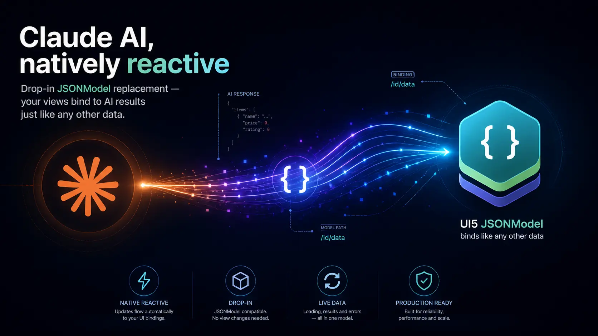
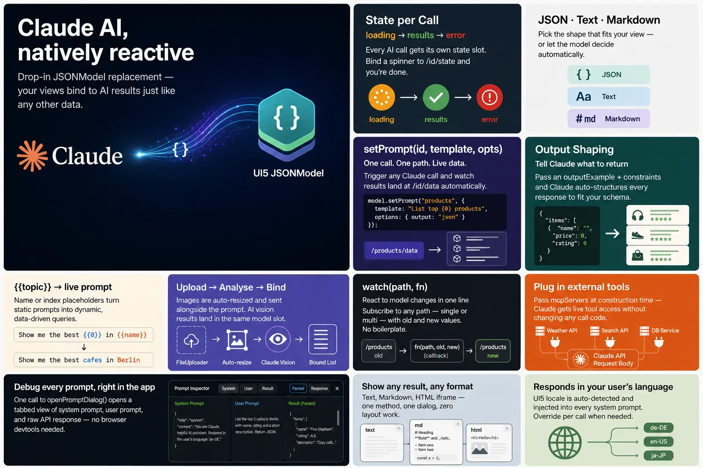

# Claude JSON Model

A SAPUI5 Fiori application that generates industry-specific AI use cases via the Claude API — and a reusable **`ClaudeJSONModel`** library that makes Claude a first-class data source inside any UI5 app.



---

## Getting Started

### Prerequisites

- Node.js 24+
- An [Anthropic API key](https://console.anthropic.com/)
- SAP Work Zone tenant (for production deployment)

### API Key

Set the Anthropic API key as an environment variable before starting the dev server:

```bash
export ANTHROPIC_API_KEY="sk-ant-..."
```

To persist it across sessions, add the line to your `~/.zshrc` or `~/.bashrc`:

```bash
echo 'export ANTHROPIC_API_KEY="sk-ant-..."' >> ~/.zshrc
source ~/.zshrc
```

### Installation

```bash
npm install
```

### Running locally

```bash
npm start          # opens Fiori launchpad preview
npm run start-noflp  # opens app directly (no FLP shell)
```

The dev server includes a `claude-proxy-middleware` that forwards `/v1/messages` requests to `api.anthropic.com` using the `ANTHROPIC_API_KEY` from the environment — the key never reaches the browser.

### Environment variables

| Variable | Description |
|---|---|
| `ANTHROPIC_API_KEY` | Anthropic API key (`sk-ant-…`). Sent as `x-api-key` header. |
| `ANTHROPIC_AUTH_TOKEN` | Bearer token alternative to `ANTHROPIC_API_KEY`. Used when the key is not set. |
| `ANTHROPIC_BASE_URL` | Override the upstream endpoint (default: `https://api.anthropic.com`). Useful for corporate proxies or local Claude-compatible servers. Supports both `https://` and `http://`. |

```bash
# Standard usage
export ANTHROPIC_API_KEY="sk-ant-..."

# Bearer-token auth (e.g. AWS Bedrock or custom gateway)
export ANTHROPIC_AUTH_TOKEN="eyJhb..."
export ANTHROPIC_BASE_URL="https://my-gateway.internal"

# Local http proxy (e.g. LiteLLM)
export ANTHROPIC_BASE_URL="http://localhost:4000"
```

### Middleware options (`ui5.yaml`)

```yaml
server:
  customMiddleware:
    - name: claude-proxy
      afterMiddleware: compression
      configuration:
        anthropicVersion: "2023-06-01"        # optional override
        anthropicBeta:    "mcp-client-2025-11-20"  # optional override
```

---

## Architecture

```
Browser (UI5 App)
   │  POST /v1/messages
   ▼
ui5-tooling dev server
   │  claude-proxy-middleware
   │  injects auth header (x-api-key or Bearer)
   ▼
ANTHROPIC_BASE_URL  (default: api.anthropic.com)
```

In production (SAP Work Zone), replace the middleware with a BTP destination or a CAP service that injects the API key server-side.

---

## ClaudeJSONModel

`ClaudeJSONModel` extends `sap/ui/model/json/JSONModel`. It wraps the Anthropic Messages API and stores every response directly in the model so views can bind to the results without any extra boilerplate.



### Import

```js
sap.ui.define([
    "de/udina/model/ClaudeJSONModel"
], (ClaudeJSONModel) => {
    const oModel = new ClaudeJSONModel({ /* config */ });
    this.getView().setModel(oModel);
});
```

### Constructor options

| Option | Type | Default | Description |
|---|---|---|---|
| `data` | `object` | `{}` | Seeds the JSONModel root — use for view bindings that must exist before the first Claude call |
| `maxTokens` | `number` | `1024` | Claude `max_tokens` per request |
| `apiEndpoint` | `string` | `"/v1/messages"` | Override the API URL. Defaults to the local proxy path — no change needed for dev. |
| `language` | `string` | UI5 locale | BCP-47 locale for response language (e.g. `"de"`, `"en"`) |
| `mcpServers` | `array` | — | MCP server definitions for tool-augmented calls (see below) |

```js
const oModel = new ClaudeJSONModel({
    maxTokens: 1500,
    language: "de",
    data: {
        filter: { industry: "", focus: "" },
        generateEnabled: false
    }
});
```

> **Note:** `apiEndpoint` defaults to `"/v1/messages"`, which routes through the dev-server proxy. Explicit `apiEndpoint: "/v1/messages"` is no longer necessary.

---

### `setPrompt(sId, sTemplate, oOptions)`

The core method. Fires a Claude API call and stores the result under `/{sId}` in the model.

**State paths written automatically:**

| Path | Values |
|---|---|
| `/{sId}/state` | `"loading"` → `"results"` or `"error"` |
| `/{sId}/data` | Parsed response (object, array, string) |
| `/{sId}/error` | Error message string on failure |

Bind these in XML views directly:

```xml
<BusyIndicator visible="{= ${/useCases/state} === 'loading' }"/>
<List items="{/useCases/data}">...</List>
<MessageStrip visible="{= ${/useCases/state} === 'error' }" text="{/useCases/error}"/>
```

One model instance handles multiple independent calls — each identified by its `sId`.

---

#### Response types

**`"text"` (default)** — plain text response, stored as a string:

```js
oModel.setPrompt("summary", "Summarize the benefits of SAP S/4HANA in 3 sentences.");
// result at /summary/data → string
```

**`"markdown"`** — response rendered to HTML via `marked.js` (auto-loaded from CDN):

```js
oModel.setPrompt("report", "Write a structured implementation report.", {
    responseType: "markdown"
});
// result at /report/data → HTML string, ready for FormattedText binding
```

**`"json"`** — structured JSON, automatically inferred when `outputExample` is provided:

```js
oModel.setPrompt("useCases", "Generate 3 AI use cases for {/filter/industry}.", {
    outputExample: [{
        name: "Title",
        desc: "Description",
        impact: 85,
        effort: 40,
        tags: ["Tag1"]
    }]
});
// result at /useCases/data → parsed JS array
```

---

#### Template placeholders

Prompts support three kinds of single-brace `{...}` placeholders that are resolved before the request is sent. All three can be mixed freely in one template.

---

##### `{param>key}` — explicit parameter injection

Reads a value from the `params` object passed in `oOptions`. Best for values that are computed at call time (not in the model) or that come from a UI binding context.

```js
oModel.setPrompt("result", `
    You are an SAP AI use case consultant.
    Generate use cases for the industry "{/selectedIndustry}".{param>focusPart}
`, {
    params: {
        focusPart: sFocus ? ` Focus: ${sFocus}.` : ""
    }
});
```

```js
// Deep dive — title from a list item's binding context
oModel.setPrompt("deepDive", `
    Create a structured deep dive for the AI use case "{param>name}"
    in the industry "{/selectedIndustry}".
`, {
    params: { name: oData.name }   // oData comes from oCtx.getObject()
});
```

---

##### `{/path}` — live model binding

Reads a value directly from the model at the given property path. No `params` entry is needed — the model is queried at call time.

```js
// Model has: /userPrompt = "How to use BTP?"  /selectedLimit = 5
oModel.setPrompt("search", `
    Search SAP documentation for: "{/userPrompt}"
    Limit results to {/selectedLimit}.
`);
```

```js
// Model has: /languages = ["de", "en"]
oModel.setPrompt("vision", `
    Describe this image in the following languages: {/languages}.
`, {
    image: oModel.getImage("vision")
});
```

---

##### `{MAP_NAME>/path|fallback}` — mapped model binding

Looks up the value of model property `/path` as a key in the named map `maps.MAP_NAME`. Useful for translating short selection codes (e.g. `"AUTO"`) into rich prompt text without polluting the prompt template with conditional logic.

Syntax: `{mapName>/model/path}` or `{mapName>/model/path|fallbackKey}`

```js
const mIndustryDescriptions = {
    AUTO:   "the automotive and mobility industry",
    RETAIL: "the retail and consumer goods sector",
    BANK:   "the banking and financial services industry",
    MFG:    "discrete and process manufacturing"
};

// Model has: /filter/selectedIndustry = "RETAIL"
oModel.setPrompt("useCases", `
    Generate 5 AI use cases for {industries>/filter/selectedIndustry|AUTO}.
    Focus on SAP BTP solutions.
`, {
    maps: { industries: mIndustryDescriptions }
});
// → "Generate 5 AI use cases for the retail and consumer goods sector."
```

**With fallback key** — if the model path resolves to a key that is not in the map, the fallback key is used instead:

```js
// If /filter/selectedIndustry = "UNKNOWN" → falls back to map["AUTO"]
"{industries>/filter/selectedIndustry|AUTO}"
// → "the automotive and mobility industry"
```

**Multiple maps** — pass as many named maps as needed:

```js
oModel.setPrompt("report", `
    Analyze {industries>/filter/industry} with focus on {horizons>/filter/horizon|short}.
`, {
    maps: {
        industries: mIndustryDescriptions,
        horizons: {
            short:  "short-term wins (0–6 months)",
            medium: "medium-term goals (6–18 months)",
            long:   "long-term transformation (18+ months)"
        }
    }
});
```

---

> **Note:** The legacy `{{name}}` and `{{0}}` double-brace syntax is no longer supported. Use `{param>name}` and `{/path}` instead.

---

#### `outputExample` — structured JSON output

Pass an example of the expected JSON structure. Claude is instructed to match it exactly. A single object or an array are both supported:

```js
oModel.setPrompt("kpis", "Generate 5 KPIs for {param>dept}.", {
    params: { dept: "Finance" },
    outputExample: [{ kpi: "Name", unit: "EUR", target: 100 }]
});
```

---

#### `constraints` — field-level value rules

Inject typed constraints into the system prompt to get predictable numeric ranges:

```js
oModel.setPrompt("useCases", sPrompt, {
    outputExample: [{ name: "", impact: 0, effort: 0 }],
    constraints: {
        impact: { type: "integer", min: 10, max: 99 },
        effort: { type: "integer", min: 10, max: 99 }
    }
});
```

Supported constraint keys: `type`, `min`, `max`.

---

#### `mapper` — transform results after parsing

Applied to each array element (or to the whole result if not an array):

```js
oModel.setPrompt("useCases", sPrompt, {
    outputExample: [{ name: "", impact: 0, effort: 0 }],
    mapper: (uc, i) => ({
        ...uc,
        index: i + 1,
        impact: Math.round(uc.impact)   // ensure integer
    })
});
```

---

#### `language` per-call override

Override the model-level language for a single call:

```js
oModel.setPrompt("summary", sPrompt, { language: "en" });
```

---

#### `image` — vision input

Pass a base64 image data URL alongside the prompt. Use `readImageAsBase64()` to prepare the image from a `FileUploader`, then forward the stored data URL:

```js
oModel.setPrompt("vision", "What is shown in this image? List all visible elements.", {
    image: oModel.getImage("vision")
});
```

---

### `watch(vPath, fnCallback)`

Vue-like reactive watcher. Fires whenever a model path changes:

```js
// Single path
oModel.watch("/filter/selectedIndustry", (newVal, oldVal) => {
    oModel.setProperty("/generateEnabled", !!newVal);
});

// Multiple paths — fires when either changes
oModel.watch(["/briefing/state", "/filter/industry"],
    ([newState, newIndustry], [oldState, oldIndustry]) => {
        if (newState === "results") console.log("done for", newIndustry);
    }
);
```

---

### `openPromptDialog(sId, oOwner)`

Opens a **Prompt Inspector** dialog showing the exact system and user prompts sent to Claude, plus the parsed result and raw API response. Useful during development to understand and tune prompt behavior.

```js
oModel.openPromptDialog("useCases", this.getView());
```

The inspector supports multiple tabs (one per `sId`), a toggle between the parsed result and the raw API response JSON, and shows token counts and estimated cost in the footer bar.

---

### `showDialog(mConfig)`

Displays content in a reusable dialog. When `content` is a `Promise`, the dialog opens immediately in busy state and populates once the promise resolves. Static content supports plain text, formatted HTML, markdown (rendered via `marked`), and iframe embeds.

**Async (Promise) content:**

```js
oModel.showDialog({
    title: "Deep Dive",
    content: oModel.setPrompt("deepDive", sPrompt, { responseType: "markdown" }),
    contentType: "markdown",
    owner: this.getView(),
    contentWidth: "40rem"
});
```

When `contentType` is omitted for Promise content, strings are rendered as HTML and objects/arrays are formatted as JSON inside `<pre>` tags.

**Static content:**

```js
// Markdown
oModel.showDialog({
    title: "About",
    content: "## Hello\nThis is **markdown**.",
    contentType: "markdown",
    owner: this.getView()
});

// External URL in iframe
oModel.showDialog({
    title: "SAP Help Portal",
    content: "https://help.sap.com/...",
    contentType: "html",
    contentHeight: "80vh",
    owner: this.getView()
});
```

| Option | Type | Default | Description |
|---|---|---|---|
| `content` | `string\|Promise` | — | Static string or Promise resolving to the result (e.g. return value of `setPrompt`) |
| `title` | `string` | `""` | Dialog title |
| `contentType` | `string` | `"text"` | `"text"`, `"formattedText"`, `"markdown"`, or `"html"` |
| `id` | `string` | `"__result__"` | Key for dialog reuse across Promise calls |
| `owner` | `object` | — | UI5 control to call `addDependent` on (first call only) |
| `contentWidth` | `string` | `"50rem"` | Dialog width (`"40rem"` default for Promise path) |
| `contentHeight` | `string` | — | Dialog/iframe height (default for `"html"`: `"70vh"`) |

| `contentType` | Description |
|---|---|
| `"text"` | Plain text, HTML-escaped |
| `"formattedText"` | Raw HTML string (sap.m.FormattedText) |
| `"markdown"` | Rendered via marked.js |
| `"html"` | Embedded in an `<iframe>` |

---

### `readImageAsBase64(sId, oEvent, mOptions)`

Reads an image from a `FileUploader` `change` event, resizes it client-side via `<canvas>`, and stores the result as a base64 WebP data URL at `/{sId}/image`. Resets `/{sId}/state` to `"idle"` so the UI does not show stale results.

```js
oFileUploader.attachChange(oEvent => {
    oModel.readImageAsBase64("vision", oEvent, { size: 512, quality: 0.7 });
});
```

| Option | Default | Description |
|---|---|---|
| `size` | `512` | Max dimension in pixels before resizing |
| `quality` | `0.7` | WebP quality (0–1) |

Returns a `Promise` that resolves with the data URL, or `null` if no valid image was selected.

---

### `getImage(sId)`

Returns the stored base64 data URL previously written by `readImageAsBase64()`, or `null` if none is set.

```js
const sDataUrl = oModel.getImage("vision");
```

---

### Token usage & cost tracking

After every successful `setPrompt` call the model publishes a `usageCost` event on the UI5 `EventBus`. Subscribe from any controller to react to token consumption — for example to accumulate session cost in a shared model.

```js
sap.ui.require(["sap/ui/core/EventBus", "de/udina/model/ClaudeJSONModel"],
    (EventBus, ClaudeJSONModel) => {

    EventBus.getInstance().subscribe("claude.model", "usageCost", (sChannel, sEvent, oData) => {
        // oData: { usage: { input_tokens, output_tokens, ... }, model: "claude-sonnet-4-6", id: "useCases" }
        const nCost = ClaudeJSONModel.calcCost(oData.usage, oData.model);
        console.log(`[${oData.id}] in:${oData.usage.input_tokens} out:${oData.usage.output_tokens} ~$${nCost.toFixed(5)}`);
    });
});
```

**`ClaudeJSONModel.calcCost(oUsage, sModel)`** — static helper that converts an API usage object into an estimated USD cost:

```js
const nCost = ClaudeJSONModel.calcCost(oResponse.usage, "claude-sonnet-4-6");
// returns a number, e.g. 0.000045
```

Pricing tiers (as of 2026-05-05, per 1 M tokens):

| Tier | Input | Output |
|---|---|---|
| Haiku | $0.80 | $4.00 |
| Sonnet | $3.00 | $15.00 |
| Opus | $15.00 | $75.00 |

The **Prompt Inspector** (`openPromptDialog`) shows token counts and estimated cost in its footer bar for each call.

---

### MCP server integration

Pass `mcpServers` to enable tool-augmented calls via the [MCP client beta](https://docs.anthropic.com/en/docs/agents-and-tools/mcp).

The example below uses the public **SAP Docs MCP Server** by [Marian Zeis](https://github.com/marianfoo/mcp-sap-docs), which provides search and retrieval across 50 000+ SAP documentation files (UI5, CAP, ABAP, Cloud SDK):

```js
const oModel = new ClaudeJSONModel({
    mcpServers: [{
        type: "url",
        url: "https://mcp-sap-docs.marianzeis.de/mcp",
        name: "sap-docs"
    }]
});
```

The model automatically adds the `anthropic-beta: mcp-client-2025-11-20` header and wires up the MCP toolset.

---

## Project structure

```
webapp/
  model/
    ClaudeJSONModel.js   # Core library — copy into any UI5 project
    models.js
  controller/
    View.controller.js   # Demo app controller
  view/
    View.view.xml
middleware/
  claude-proxy.js        # ui5-tooling middleware — proxies /v1/* to Anthropic
  package.json
docs/
  ClaudeJSONModel.webp   # Architecture overview
```

---

## License

This work is [dual-licensed](./LICENSE.md) under Apache 2.0 and the Derived Beer-ware License. The official license will be Apache 2.0 but finally you can choose between one of them if you use this work.

When you like this stuff, buy [Holger Schäfer](https://www.linkedin.com/in/holger-schäfer-483ba73) a beer when you see him.